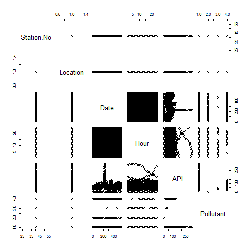

Developing Data Products: Banting Air Pollutant Index (API) 2013-2015
========================================================
author: Haizan
date: February 5, 2016

Introduction
========================================================

Name of application: "Banting Air Pollutant Index (API) 2013-2015" 

- This is the application needed for the assignment for the course "Developing Data Products" 
- The data used in this application is the Air Pollution Index (API) in Banting area; for August 2013 to February 2015
- Banting is a collection area where air pollutant is measured by the Malaysian Meteorological Department 
- The data was gathered from <http://www.data.gov.my/> 


Data Summary and Plot
========================================================


```r
# setwd("C:/coursera/Project9")
banting<-read.csv("banting.csv")
summary(banting)
```

```
   Station.No    Location             Date            Hour      
 Min.   :41   Banting:13296   2013-08-01:   24   Min.   : 1.00  
 1st Qu.:41                   2013-08-02:   24   1st Qu.: 6.75  
 Median :41                   2013-08-03:   24   Median :12.50  
 Mean   :41                   2013-08-04:   24   Mean   :12.50  
 3rd Qu.:41                   2013-08-05:   24   3rd Qu.:18.25  
 Max.   :41                   2013-08-06:   24   Max.   :24.00  
                              (Other)   :13152                  
      API         Pollutant
 Min.   :  0.00   *:10855  
 1st Qu.: 38.00   0:  567  
 Median : 49.00   a:   32  
 Mean   : 49.82   c: 1842  
 3rd Qu.: 59.00            
 Max.   :323.00            
                           
```


Shiny Apps
========================================================

The shiny apps can be viewed at https://haizany.shinyapps.io/Project/

The code for the shiny apps can be downloaded from the github repo at https://github.com/Haizany/Project9 


Reproducible Codes
========================================================

The repository at https://github.com/Haizany/Project9 contains all the codes and data involved. The files and folders are as follows:

- README.md
- The shiny app code: ui.R and server.R
- The data involved: banting.csv
- files for R Markdown, RStudio Presenter presentation and html
